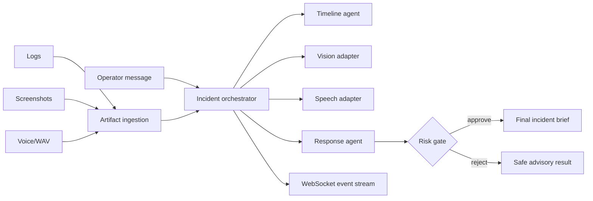

# Multimodal Ops Copilot

[](https://github.com/ZhengjunSun/multimodal-ops-copilot/actions/workflows/ci.yml)

A full-stack incident collaboration system that accepts logs, screenshots, audio and operator messages. It builds an evidence-backed timeline, streams progress to the browser, supports interruption, and gates high-risk remediation behind human approval.



## Engineering highlights

- Multipart ingestion for `.log`, `.txt`, `.json`, `.png`, `.jpg` and `.wav`
- Content hashing, safe filenames and bounded upload sizes
- WAV metadata extraction, image dimensions and deterministic log event parsing
- OpenAI-compatible text/vision/STT adapters with a fully offline provider
- Persistent sessions, artifacts, timeline events, approvals and traces in SQLite
- Real-time WebSocket progress and operator interruption
- Explicit `waiting_approval` state for remediation proposals
- Browser console with drag-and-drop uploads and microphone recording
- Docker/Compose deployment, API tests and runtime tests

## Run locally

```bash
python -m venv .venv
# Windows: .venv\Scripts\activate
pip install -e ".[dev]"
uvicorn ops_copilot.api:app --reload
```

Open <http://localhost:8010>. The default offline provider requires no API key.

For an OpenAI-compatible endpoint:

```bash
set OPS_MODEL_PROVIDER=openai-compatible
set OPS_MODEL_BASE_URL=http://localhost:11434/v1
set OPS_MODEL_NAME=qwen3-vl
set OPS_MODEL_API_KEY=local-placeholder
```

## Responsible use

All bundled examples are synthetic. The application produces advisory incident briefs and never changes a real system. Audio and images remain in the configured local artifact directory. Do not upload confidential material to an untrusted model endpoint.

## Verify the claims

- [Architecture and evidence model](docs/architecture.md)
- [Five-minute multimodal demo](docs/demo.md)
- [Reproducible benchmark report](docs/benchmark.md)

```bash
python scripts/benchmark.py --sessions 100
```

## License

MIT
