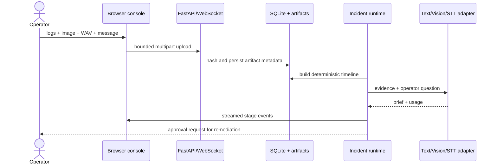

# Architecture and evidence model

## Trust boundaries

- Uploaded names are normalized and files are size-bounded.
- SHA-256 ties every derived result to an artifact.
- Timeline parsing is deterministic and separate from model interpretation.
- Provider calls are isolated behind one adapter and can remain fully offline.
- Remediation is advisory; even an approved proposal records `action_executed=false`.
- Interruption is a first-class state and emits an auditable event.

